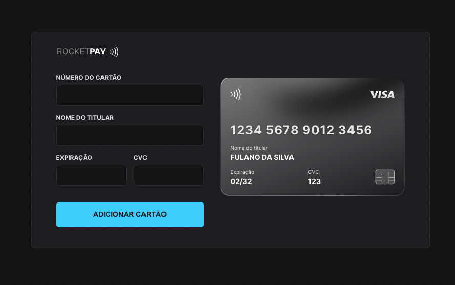

# Rocketpay

## 💻 Sobre

O Rocketpay é um componente que simula o formulário de preenchimento de cartão de crédito, utilizando da lib "IMask" para adicionar máscara aos inputs " e atualizando elementos HTML via DOM.

## 🔖 Layout

Você pode visualizar o layout do projeto no Figma através [DESSE LINK](https://www.figma.com/file/gpqavL469k0pPUGOmAQEM9/Explorer-Lab-%2301/duplicate).

## Outros

Esse projeto foi desenvolvido com as seguintes tecnologias:

- HTML e CSS
- JavaScript e JSON
- [Node e NPM](https://nodejs.org/)
- [Vite](https://vitejs.dev/)
- [iMask](https://imask.js.org)